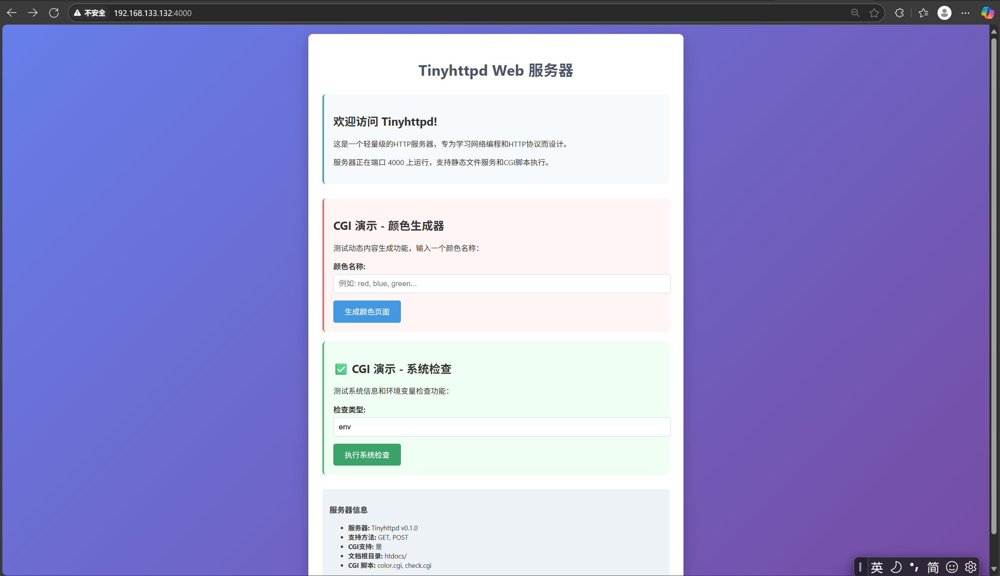
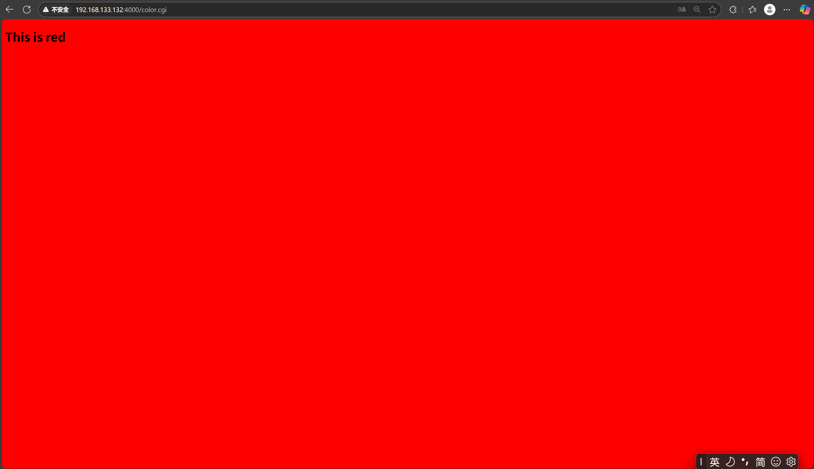
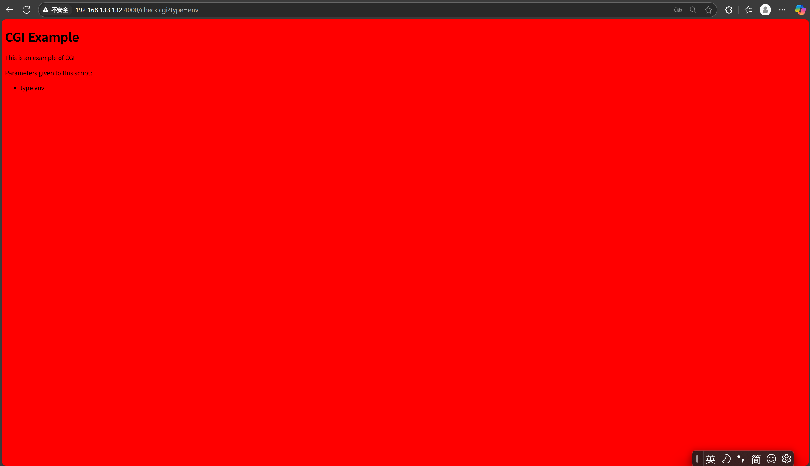

# Tinyhttpd  

一个轻量级的 HTTP 服务器实现，专为学习网络编程和 HTTP 协议而设计。 

## 项目概述  

Tinyhttpd 是由 J. David Blackstone 于 1999 年创建的教育性 HTTP 服务器。  该项目展示了 Web 服务器的核心概念，包括套接字编程、HTTP 请求处理、静态文件服务和 CGI 脚本执行。

### 主要特性  

- 支持 GET 和 POST HTTP 方法  
- 静态文件服务  
- CGI 脚本执行支持  
- 多线程并发处理  
- 基本的 HTTP 错误处理  

## 系统架构  

### 核心组件  

| 函数名             | 功能描述                                         |
| ------------------ | ------------------------------------------------ |
| `main()`           | 服务器入口点，设置服务器套接字并接受连接         |
| `startup()`        | 初始化 HTTP 服务，建立套接字、绑定端口、开始监听 |
| `accept_request()` | 处理 HTTP 请求的核心函数                         |
| `execute_cgi()`    | 执行 CGI 程序处理动态内容                        |
| `serve_file()`     | 提供静态文件服务                                 |
| `get_line()` | 从套接字读取一行数据 | 

### 请求处理流程  

1. **服务器启动**：在指定端口绑定 HTTP 服务 
2. **接收请求**：监听端口接收 HTTP 请求，为每个连接创建新线程 
3. **解析请求**：提取 HTTP 方法（GET/POST）和 URL 
4. **路径处理**：格式化 URL 到服务器文件路径（htdocs 目录） 
5. **内容分发**：根据请求类型提供静态文件或执行 CGI 脚本 

# 测试CGI时需要本机安装PERL，同时安装perl-cgi

注意给.cgi文件执行权限

chmod +x htdocs/color.cgi

chmod +x htdocs/check.cgi

如果是虚拟机给防火墙的4000端口开放

# 编译

gcc httpd.c -pthread -o httpServer

# 效果图

